# Typeset HTML — 中英文混排长文排版模板库

7 个自包含的 HTML 排版模板，覆盖传统书籍到技术文档的不同气质。不依赖任何外部 CSS 库或构建工具。

## Claude Code 集成

任意目录说「输出 HTML」，自动匹配模板并生成排版文件。

### 配置

把下面这段发给 Claude Code：

```markdown
请帮我安装配置 typeset-html 排版模板库：

1. git clone https://github.com/wwq0327/typeset-html.git ~/Projects/typeset-html
2. 在 ~/.claude/CLAUDE.md 末尾添加：

## 排版输出

当用户说「输出 HTML」「排版输出」时：
按照 ~/Projects/typeset-html/CLAUDE.md 的「自动匹配与生成」规则执行。
不用提问，直接分析内容、匹配模板、生成 HTML。

3. 完成后告诉我
```

> 路径不同时替换 `~/Projects/typeset-html`。

## 手动使用

1. 在 `templates/` 里找到与你内容类型最匹配的模板
2. 下载 `templates/<slug>/template.html`
3. 将文件投给 AI 写作 Agent，说一句「按此模板的样式生成我的内容」

## 模板预览

### 缃素 `classic-book`

暖黄纸色、首字下沉、宽边距 — 适合小说、传记、长篇叙事

<table><tr><td>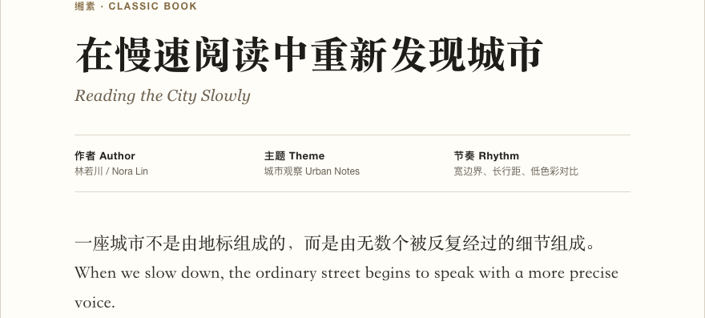</td><td>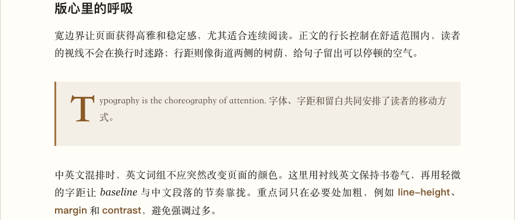</td></tr></table>

### 素笺 `song-essay`

宋体通栏、象牙白、低对比 — 适合随笔、读书笔记、讲义

<table><tr><td>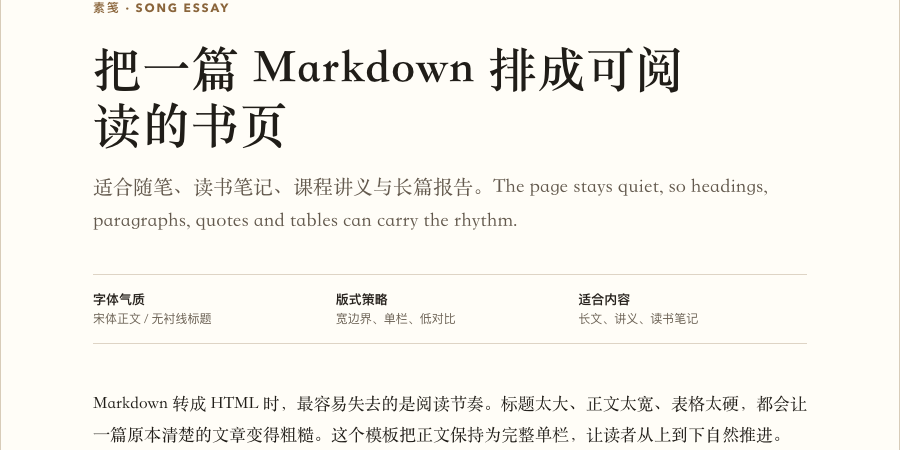</td><td>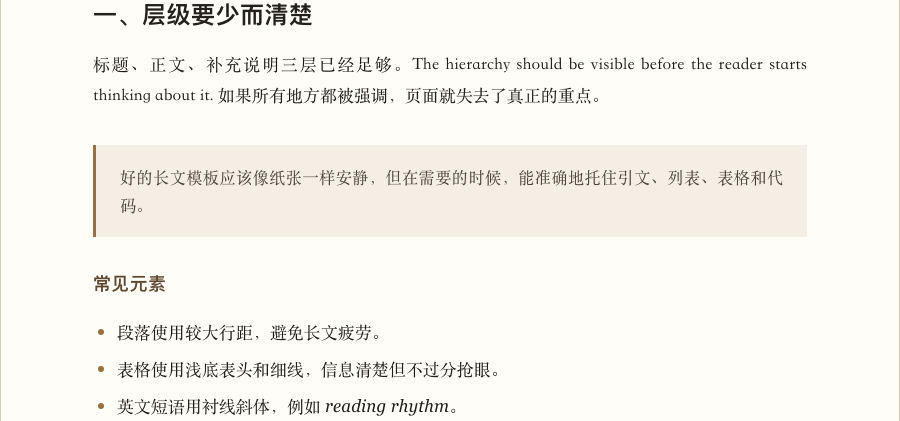</td></tr></table>

### 青简 `research-report`

青蓝冷调、柱状图、数据表嵌入 — 适合研究报告、白皮书、论文

<table><tr><td>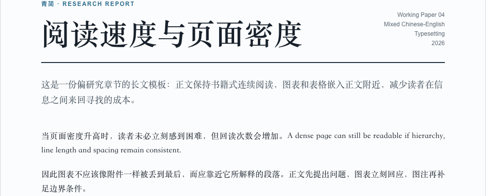</td><td>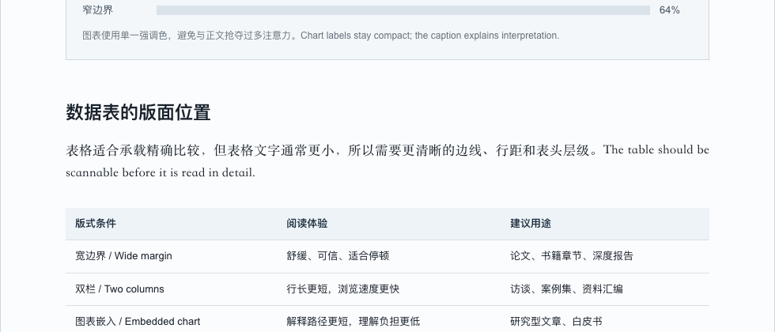</td></tr></table>

### 琥珀 `magazine-feature`

双栏正文、封面大标题、琥珀色强调 — 适合杂志专题、深度报道

<table><tr><td>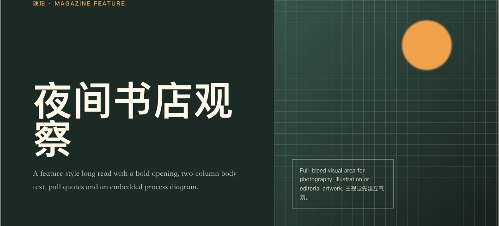</td><td>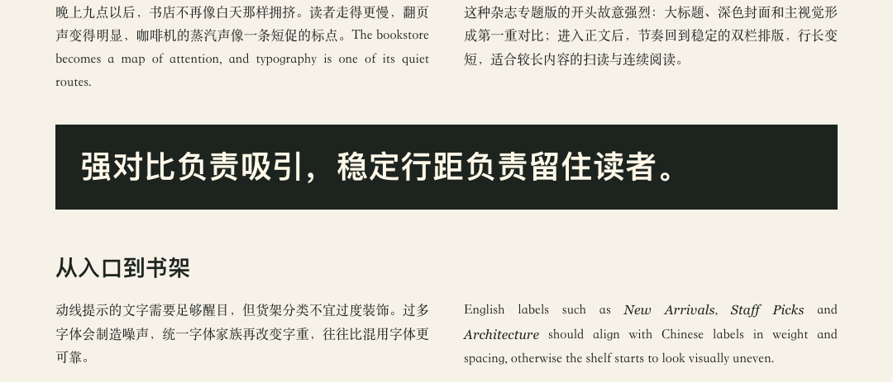</td></tr></table>

### 赭石 `editorial-feature`

赭色渐变顶栏、粗体标题、通栏正文 — 适合品牌故事、社论

<table><tr><td>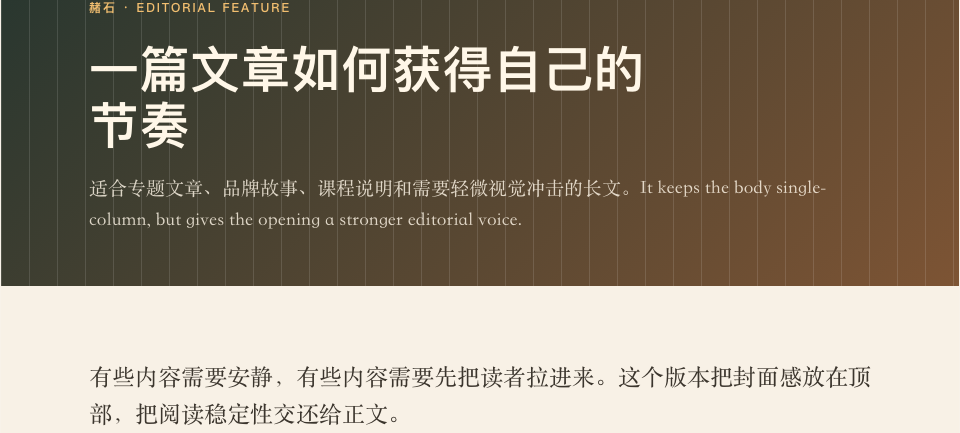</td><td>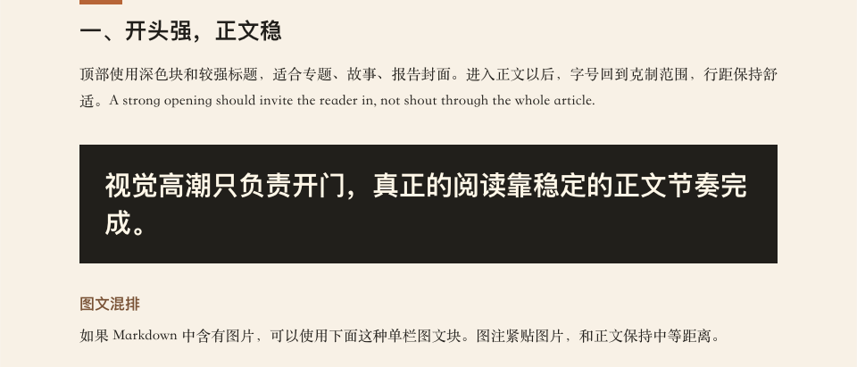</td></tr></table>

### 翠微 `modern-manual`

无衬线正文、代码块、callout 提示框 — 适合技术文档、产品手册

<table><tr><td>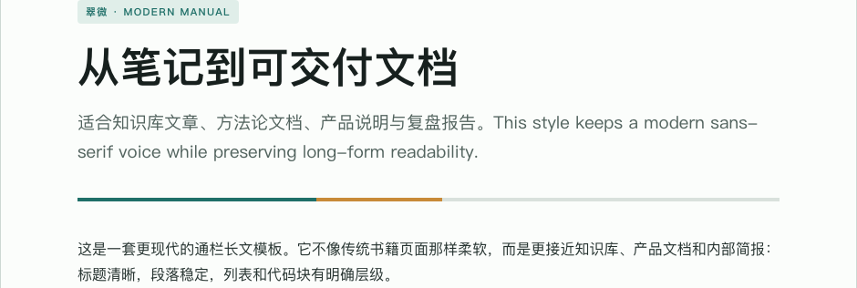</td><td>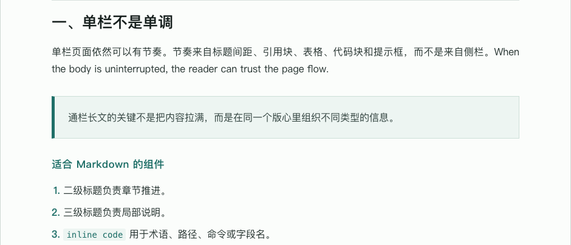</td></tr></table>

### 墨韵 `typo-primer`

以示例文章讲解排版知识 — 适合教学材料、风格展示

<table><tr><td>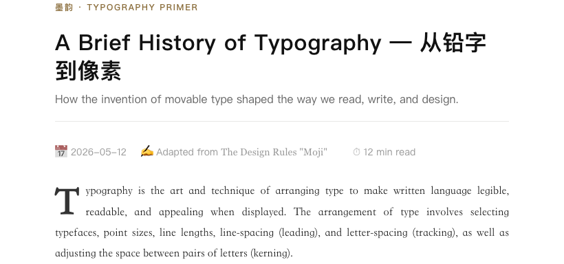</td><td>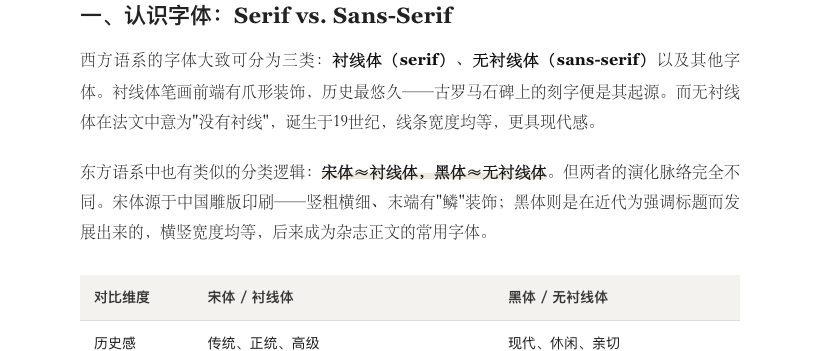</td></tr></table>

## 设计原则

理论基础来自伊达千代 & 内藤孝彦《文字设计的原理》（中信出版社，2011）。

- **三级字号**：标题 > 正文（16px / 9pt）> 补充说明，层级分明
- **行距行长**：正文 `line-height: 1.6～1.8`，中文 15～25 字/行，超长分栏
- **边界版心**：宽边界 = 高雅舒适，窄边界 = 信息量大
- **接近律**：相关内容靠近，不同内容远离，间距分远/中/近三级
- **视觉导向**：横排视线 Z 形（左上→右下），重要元素放视线起点

| 字体 | 气质 | 适用 |
|------|------|------|
| 宋体 / 衬线体 | 传统、正式、高雅 | 长篇正文 |
| 黑体 / 无衬线体 | 现代、理性、清晰 | 标题、技术文档 |
| 楷书 / 手写体 | 诚意、古典、亲切 | 特殊场合 |

- **对比四法**：字号、重量（粗细）、字体、色彩对比，差异越大越突出
- **中英混排**：英文用 `<span class="en">` 包裹衬线斜体，颜色承担分类而非装饰
- **一致性**：同一作品字体家族统一，用腰线/字号变化区分层级，不混用字体

模板由 Codex（GPT-5）生成初稿，人工微调至符合上述原则。

## 技术说明

- 每个模板是独立的 HTML 文件，CSS 全部内嵌
- 无需 Node.js、npm 或任何构建步骤
- 用浏览器直接打开即可预览排版效果
- 自动匹配规则在 `CLAUDE.md`，Agent 操作手册在 `AGENTS.md`
